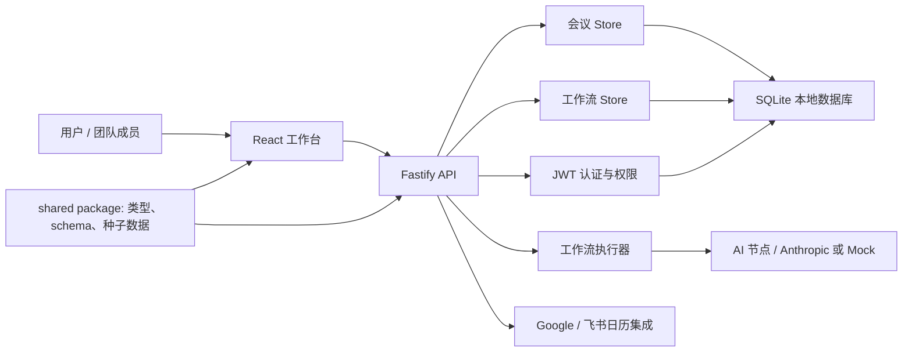

# Meeting Flow Studio

Meeting Flow Studio 是一个面向团队会议协作的流程编排工作台。它将会议申请、议程生成、上下文查询、审批节点、日历同步、运行记录和会后行动项抽象成一条可视化的 Meeting Flow，让会议不再只是日程，而是可以配置、运行、追踪和复盘的业务流程。

这个项目适合作为全栈简历项目展示：前端包含高密度 SaaS 工作台、可视化流程画布和节点配置体验；后端提供认证、权限、会议数据、工作流模板、运行记录、日历集成和调度执行能力；共享包负责沉淀前后端通用类型、schema、种子数据和默认工作流模板。

## 项目亮点

- 可视化会议流程编排：基于 React Flow 实现流程画布、节点状态、连线状态、画布聚焦缩放和节点配置。
- 会议工作台：包含会议队列、筛选排序、会议详情、议程、参会人、待办事项和流程操作区。
- 工作流运行模型：支持工作流模板、节点运行状态、阻塞处理、重试、取消、运行日志和配置快照。
- 认证与权限：基于 JWT 的登录注册、会话校验和 admin / editor / viewer 角色能力。
- 日历集成：提供 Google Calendar / Meet 和飞书日历 OAuth 接入、授权状态展示和会议同步。
- AI-ready 节点：AI 节点可接入 Anthropic；未配置密钥时使用本地模拟输出，便于演示和开发。
- Monorepo 工程化：使用 pnpm workspace 管理 web、api、shared 三个 package，统一构建、类型检查和测试。
- CI 覆盖：GitHub Actions 在 push / pull request 时执行安装、测试和构建。

## 技术栈

| 模块 | 技术 |
| --- | --- |
| 前端 | React, TypeScript, Vite, React Flow |
| 后端 | Fastify, TypeScript, JWT, bcryptjs, node-cron |
| 数据 | SQLite, 本地持久化 store |
| 类型与校验 | Zod, shared package |
| 日历集成 | Google Calendar API, Feishu/Lark Calendar API |
| AI 节点 | Anthropic SDK，可选启用 |
| 工程化 | pnpm workspace, GitHub Actions |

## 核心功能

### 会议工作台

- 查看会议队列、状态、优先级、组织者和会议时间。
- 支持搜索、筛选、排序和会议状态切换。
- 支持新建、编辑、删除会议。
- 展示会议议程、参会人、待办事项和当前流程运行状态。

### 流程画布

- 支持三类默认工作流模板选择。
- 基于 React Flow 展示节点、连线、运行态和阻塞态。
- 点击画布后进入鼠标焦点状态，只有聚焦时滚轮才会缩放画布。
- 支持新增节点、拖拽节点、连接节点、保存画布和放弃修改。
- 节点配置面板支持编辑标题、描述、类型、负责人、输入输出和配置字段。

### 工作流运行

- 支持从当前会议启动工作流。
- 支持查看运行摘要、运行日志和节点执行时间线。
- 支持阻塞节点处理、失败重试和取消运行。
- 支持保存运行时的配置快照，用于对比当前模板配置。

### 外部日历

- Google Calendar / Meet：
  - 支持 OAuth 授权 URL 生成。
  - 支持 token 保存和刷新。
  - 支持创建或更新会议日历事件。
  - 可生成 Google Meet 会议链接。
- 飞书日历：
  - 支持 OAuth 授权 URL 生成。
  - 支持 token 保存和刷新。
  - 支持同步会议到飞书日历。
- 未配置真实 OAuth 参数时，会降级为本地 mock 同步结果，方便演示。

## 项目结构

```text
meeting-flow-studio/
  apps/
    api/                 Fastify API 服务
      src/
        services/        认证、执行器、日历、AI、调度等业务服务
        server.ts        API 路由入口
        meetingStore.ts  会议数据持久化
        userStore.ts     用户数据持久化
        workflowStore.ts 工作流模板与运行记录持久化
    web/                 React + Vite 前端工作台
      src/
        components/      auth、common、meetings、workflow 组件
        contexts/        认证上下文
        hooks/           会议、工作流、日历集成 hooks
        lib/             API client、格式化工具
        App.tsx          工作台主入口
  packages/
    shared/              前后端共享类型、Zod schema、种子数据和模板
  .github/workflows/     CI 配置
```

## 架构概览



## 快速开始

### 环境要求

- Node.js 22+
- pnpm 11.7.0+

### 安装依赖

```bash
pnpm install
```

### 启动开发环境

```bash
pnpm dev
```

默认访问地址：

| 服务 | 地址 |
| --- | --- |
| 前端 | `http://127.0.0.1:5173` |
| 后端 | `http://127.0.0.1:8787` |

### 默认账号

默认种子账号密码均为 `admin123`：

| 角色 | 邮箱 | 说明 |
| --- | --- | --- |
| 管理员 | `admin@meetingflow.local` | 可管理全部会议和流程 |
| 编辑者 | `editor@meetingflow.local` | 可编辑自己有权限的会议 |
| 观察者 | `viewer@meetingflow.local` | 偏查看权限 |

## 常用命令

```bash
pnpm dev          # 同时启动 api 和 web
pnpm dev:api      # 只启动后端
pnpm dev:web      # 只启动前端
pnpm typecheck    # 全仓库类型检查
pnpm test         # 类型检查 + shared 测试
pnpm build        # 全仓库构建
```

## 环境变量

可以参考 `apps/api/.env.example` 创建 `apps/api/.env`。

| 变量 | 说明 |
| --- | --- |
| `PORT` | API 端口，默认 `8787` |
| `HOST` | API 监听地址，默认 `127.0.0.1` |
| `JWT_SECRET` | JWT 签名密钥，生产环境必须覆盖 |
| `ANTHROPIC_API_KEY` | 可选，配置后 AI 节点调用 Anthropic |
| `GOOGLE_CLIENT_ID` | Google OAuth Client ID |
| `GOOGLE_CLIENT_SECRET` | Google OAuth Client Secret |
| `GOOGLE_REDIRECT_URI` | Google OAuth 回调地址 |
| `FEISHU_APP_ID` | 飞书应用 ID |
| `FEISHU_APP_SECRET` | 飞书应用密钥 |
| `FEISHU_REDIRECT_URI` | 飞书 OAuth 回调地址 |
| `FEISHU_CALENDAR_ID` | 飞书日历 ID，默认 `primary` |
| `FEISHU_OAUTH_SCOPES` | 飞书授权 scope |

## Google Calendar 接入

1. 在 Google Cloud Console 创建项目。
2. 启用 Google Calendar API。
3. 创建 OAuth Client，应用类型选择 Web application。
4. 在 Authorized redirect URIs 中加入：

```text
http://127.0.0.1:8787/api/integrations/google/callback
```

5. 在 `apps/api/.env` 中配置：

```bash
GOOGLE_CLIENT_ID=
GOOGLE_CLIENT_SECRET=
GOOGLE_REDIRECT_URI=http://127.0.0.1:8787/api/integrations/google/callback
```

6. 在工作台的日历接入区域点击连接 Google，授权后即可同步会议。

当前使用 `https://www.googleapis.com/auth/calendar.events` scope，仅创建或更新由本应用同步的日历事件。参会人目前只有姓名字段，第一版会写入事件描述，不会自动发送 Google Calendar 邀请邮件。

## 飞书日历接入

1. 在飞书开放平台创建应用。
2. 启用日历相关权限。
3. 配置 OAuth 回调地址：

```text
http://127.0.0.1:8787/api/integrations/feishu/callback
```

4. 在 `apps/api/.env` 中配置：

```bash
FEISHU_APP_ID=
FEISHU_APP_SECRET=
FEISHU_REDIRECT_URI=http://127.0.0.1:8787/api/integrations/feishu/callback
FEISHU_CALENDAR_ID=primary
FEISHU_OAUTH_SCOPES="calendar:calendar calendar:calendar.event:create"
```

5. 在工作台的日历接入区域点击连接飞书，授权后即可同步会议。

## 本地数据

开发数据默认写入：

```text
apps/api/data/meetings.db
```

该文件是本地运行产物，已被 `.gitignore` 忽略。删除该文件后再次启动 API，会重新写入种子用户、种子会议和默认工作流模板。

## CI

仓库包含 GitHub Actions 配置：

```text
.github/workflows/ci.yml
```

CI 会在 push 到 `main` 或创建 pull request 时执行：

```bash
pnpm install --frozen-lockfile
pnpm test
pnpm build
```

## 简历描述参考

```text
Meeting Flow Studio｜会议流程编排工作台
技术栈：React, TypeScript, Vite, React Flow, Fastify, JWT, SQLite, pnpm workspace

- 设计并实现一个面向团队会议协作的流程编排平台，将会议申请、议程生成、上下文查询、审批节点、日历同步和会后行动项抽象为可视化工作流。
- 基于 React Flow 实现流程画布，支持节点选择、节点配置、连线状态展示、画布缩放聚焦、运行状态可视化和阻塞节点处理。
- 使用 Fastify 构建后端 API，完成用户认证、角色权限、会议数据、工作流模板、运行记录和集成状态等核心模块。
- 采用 pnpm workspace 搭建 monorepo，将前后端共享类型、数据 schema 和种子数据沉淀到 shared package，减少接口类型不一致问题。
- 接入 Google Calendar / 飞书日历集成入口，支持会议同步、授权状态展示和外部日历回调配置。
```

## 后续规划

- 增加 API 集成测试，覆盖认证、权限、会议 CRUD、工作流运行和日历同步。
- 为流程画布和关键表单补充组件测试或端到端测试。
- 将 SQLite store 抽象为 repository 接口，方便迁移到 PostgreSQL 等生产数据库。
- 为工作流节点执行器补充更严格的输入输出 schema、错误分类和重试策略。
- 增加在线 Demo、工作台截图和部署文档，让项目更适合作品集展示。
